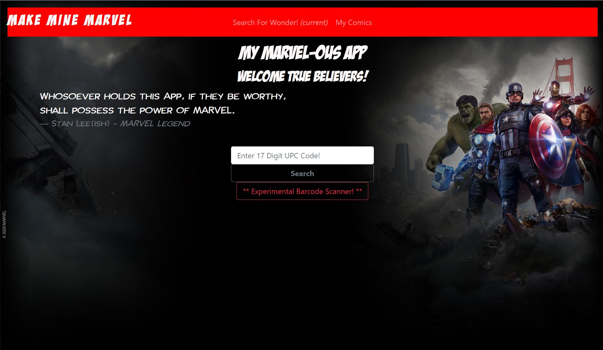
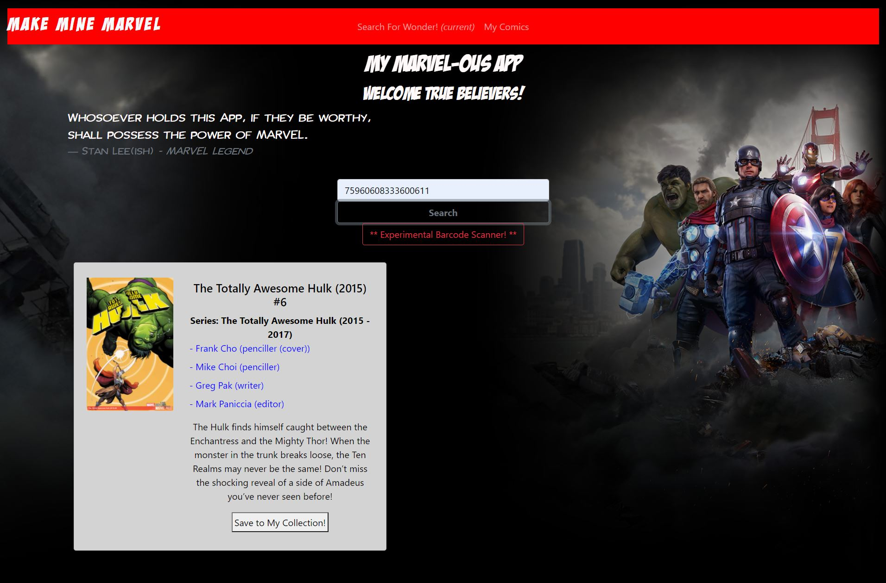
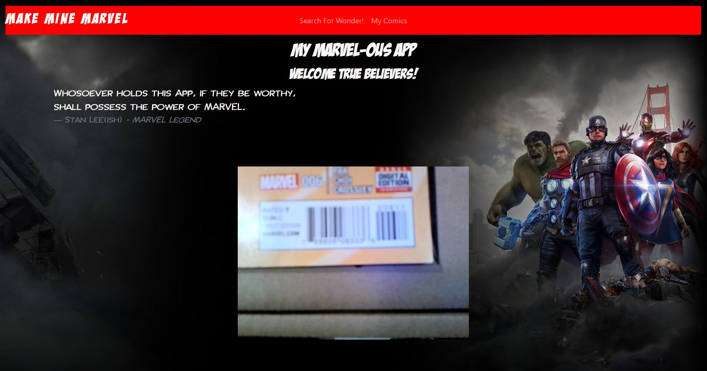

# My MARVELous App!

## Deployed site

-   https://my-marvelous-app.herokuapp.com/
-   https://github.com/mrllanes/my-marvelous-app

## Table of Contents

-   [Description](#description)
-   [Installation](#installation)
-   [Usage](#usage)
-   [Technology](#technology)
-   [Contributions](#contributions)
-   [Questions](#questions)

## Description

Are you a comic book collector? More specifically, are you a collector of the most Marvelous comics today?....MARVEL comics! Of course you are, that is why you are here. How do you keep track of your collection? Here is your answer! My MARVELous App uses the MARVEL API for information form the source. Upon completion, you will be able to sign up with your email, or use Google OAuth (sign in with your google email), search for comic books and add them to your database. You will be able to access your collection anytime you go the the store and look at back issues and make sure you do not buy the same comic twice, like I have several times. There will even be a barcode scanner feature for easier searches! (Experimental and coming soon)

## Installation Instructions

No need to install anything to use My MARVELous App. Simply go to the deployed site above and start using it.
However, if you would like, you can clone the repo, run "npm install" on the root level, then go into the client folder and run "npm install" again (since this is a REACT app). Then, back out in the root folder, run "npm start" and you will have the app running locally!

## Usage

After login, make sure you are on the SEARCH FOR WONDER! page to do a comic book search. This app is currently based off of the barcode printed on the front of the comic. Type in all 17 digits (again, experimental barcode scanner coming soon for quicker searches)! If a match is found, you will see information displayed for the comic you just searched. If it looks like the right comic and you already own it or are buying the comic, then click on the ADD TO MY COLLECTION button!

## Technology Stack

The following technologies were used to create this site/application/software/project:

-   JavaScript, HTML, CSS, Bootstrap, Heroku, Atlas.
-   MERN Stack: MongoDB/Mongoose, Express, REACT
-   Other Node packages: Bcryptjs, JWT (JSON Web Token), NodeDemon
-   Extra REACT packages: Material-ui, JWT Decode, Moment, React Google Login, React Webcam Barcode Scanner, Redux

## Contributions

The following individuals contributed to the creation of this site/application/software/project:
Super Awesome support team and Incredibly Awesome Instructor/Facilitator. Also very nice and enthusiastic Cohort members. Special thanks to: Tish McNeel, Sammantha Sasenick, Will Utterback

## Questions

If you have questions or comments about this project, please feel free to contact me via e-mail:
llanesm@gmail.com

You can also find more of my projects on my GitHub page:
https://github.com/mrllanes

## Screenshots

Please see the images below to see how My MARVELous App looks!

